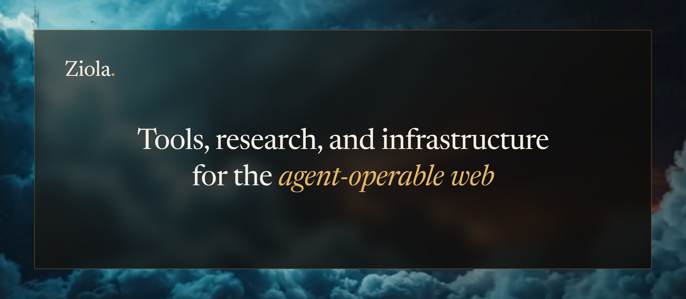

<div align="center">



<br />

**Tools for conformance, capability discovery, and intelligent interfaces.**

Independent software studio building working software for the agentic web.

[**ziola.dev**](https://ziola.dev) &nbsp;·&nbsp; [hello@ziola.dev](mailto:hello@ziola.dev)

</div>

---

## What we build

Ziola builds for the **agentic web** — where models act through the tools a page exposes, not just the pixels it renders. Our work runs along three lines: **conformance** (holding a build to a standard, deterministically), **capability discovery** (finding, understanding, and running the tools a surface offers), and the **infrastructure** that makes agent actions inspectable, interoperable, and safe to execute.

Built, not pitched. Everything below is shipping, in build, or published.

---

## Open source

### [`@zioladev/provider-tools`](https://github.com/zioladev/provider-tools)

[](https://www.npmjs.com/package/@zioladev/provider-tools)
[](https://github.com/zioladev/provider-tools/blob/main/LICENSE)
[](https://github.com/zioladev/provider-tools)

Open-source infrastructure for defining and validating structured browser tools against the experimental **WebMCP** API. Zero runtime dependencies. Built from lessons learned implementing multi-provider WebMCP journeys.

```bash
npm install @zioladev/provider-tools
```

It's **Phase 1 — the contract** — of a longer arc:

```
Provider Tools  →  Provider Conformance  →  Multi-Provider Runtime  →  Interoperability Conformance  →  Transaction Governance
   (you are here)
```

---

## Work

| Project | What it is | Status |
| :-- | :-- | :-- |
| [**sirocco.gallery**](https://sirocco.gallery) | A design system that defends itself — a live WebMCP provider. | Shipped · Origin Trial |
| [**swatchdog.dev**](https://swatchdog.dev) | The drift check for AI-built apps — design conformance over MCP. | Shipped · Connector Directory |
| [**axiomdrift.ai**](https://axiomdrift.ai) | Long-form human–LLM interaction, examined as structure. | Research |
| [**refraktor.tech**](https://refraktor.tech) | Discover, understand, and execute the tools a page exposes. | Shipped · Chrome |
| **treefrog.tech** | An interoperable WebMCP town — providers a consumer can chain. | In build |
| [**selvage.dev**](https://selvage.dev) | The transaction boundary for agentic web actions. | In build |

Full case notes and live demos: [**ziola.dev/work**](https://ziola.dev/work.html)

---

## Research

Published under **Axiom Drift**, archived on Zenodo with DOIs.

- **Beyond Content** — long-form interaction as measurable structure: *Temporal Dynamics*, *Surface Matching*, *Two Archives*.
- **Agentic Transaction Assurance** — *Before the Provider Call: Enforcing Exact-Term Authorization for State-Changing Tool Actions* — the research behind Selvage.

---

## In the wild

- **Anthropic Connector Directory** — swatchdog, listed
- **Chrome Web Store** — Refraktor & Refraktor Pro
- **Chrome Origin Trial** — sirocco.gallery & treefrog.tech, participants
- **Zenodo** — peer-archivable research with DOIs
- **Vercel Community** — swatchdog featured in the Weekly builders showcase

---

## Writing

Field notes from the build — [**ziola.dev/notes**](https://ziola.dev/blog.html):

- [Extracting a Provider Contract from a Multi-Provider WebMCP Implementation](https://ziola.dev/provider-contract.html)
- [What I Learned Building Multi-Origin WebMCP Execution](https://ziola.dev/multi-origin-webmcp.html)

---

<div align="center">

**[ziola.dev](https://ziola.dev)** &nbsp;·&nbsp; [hello@ziola.dev](mailto:hello@ziola.dev) &nbsp;·&nbsp; Ziola LLC · EST MMXXVI

</div>
